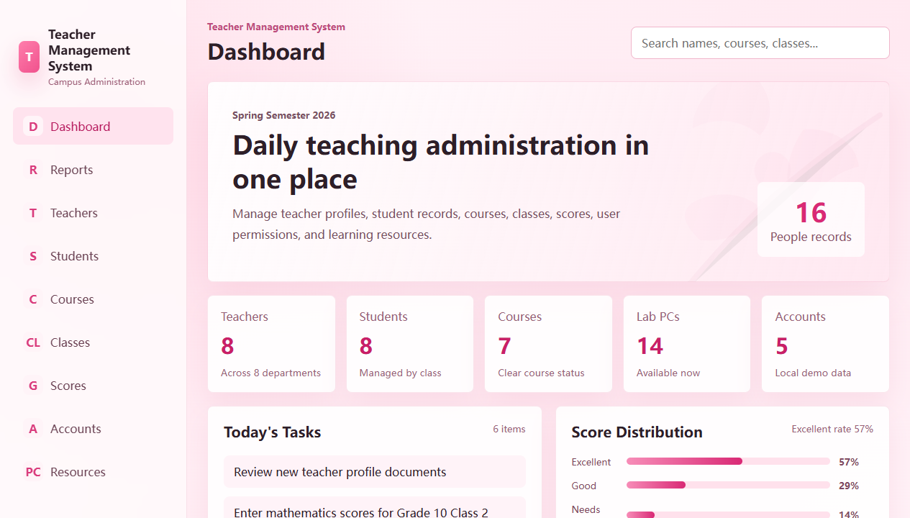
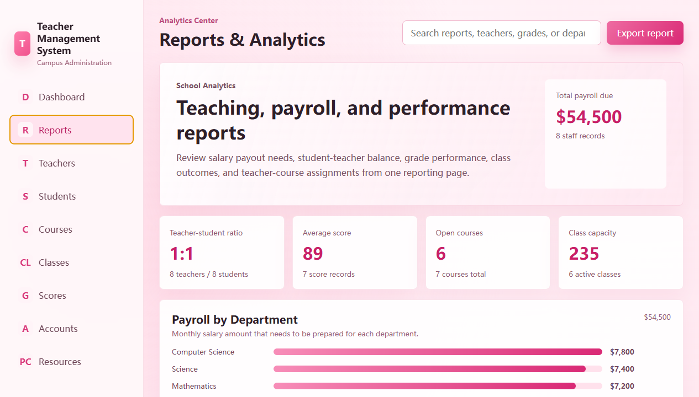
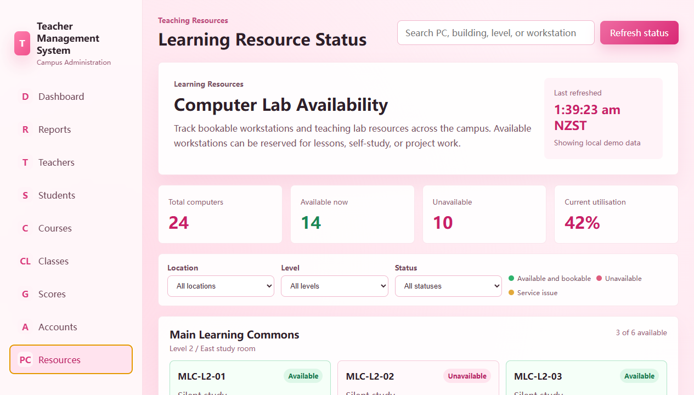

# Teacher Management System

A full-stack teacher management demo for school administration workflows. It combines a Spring Boot backend, MySQL schema, and a Vue 3 admin dashboard for managing teachers, students, courses, classes, scores, accounts, reports, and learning resources.



## What It Does

This project gives administrators one place to manage daily teaching operations. The frontend includes a polished dashboard, searchable data modules, add/edit/delete dialogs, CSV export, report analytics, and a learning resource availability page. The backend provides a Spring Boot REST foundation for connecting these modules to persistent data.

## Preview

The opening screenshot shows the dashboard with key records, daily tasks, score distribution, department coverage, and recent activity.

### Reports and Analytics

The reports page visualizes payroll needs, teacher-student ratio, average score, course status, class capacity, department payroll, grade performance, and teacher-course matching.



### Learning Resource Status

The resources page tracks computer lab availability with filters for location, level, and status.



## Core Features

- Dashboard summary for teachers, students, courses, lab PCs, and accounts.
- CRUD-style management tables with search, add, edit, delete, and empty states.
- Teacher, student, course, class, score, account, and resource modules.
- CSV export for management tables and report summaries.
- Payroll, staffing ratio, grade, class, and teacher-course analytics.
- Learning resource availability view with live-style status cards.
- Spring Boot backend structure with REST controllers, service layer, and models.
- MySQL schema for users, teachers, students, courses, scores, and resources.

## Tech Stack

| Layer | Tools |
| --- | --- |
| Frontend | Vue 3, Vite, Element Plus, Axios |
| Backend | Java 17, Spring Boot, Spring MVC, Maven |
| Database | MySQL |
| Styling | Custom responsive CSS |

## Run Locally

### Frontend

```bash
cd frontend
npm install
npm run dev
```

Open the Vite URL shown in the terminal, usually `http://localhost:5173`.

### Backend

```bash
cd backend
mvn spring-boot:run
```

The frontend can still show local demo data if the backend is not running.

### Database

Import the schema before connecting the backend to MySQL:

```bash
mysql -u root -p < database/schema.sql
```

## Documentation

- [Reporting guide](docs/reporting-guide.md)
- [Optimization log](docs/optimization-log.md)

## Project Structure

```text
teacher-management-system/
|-- backend/
|   |-- pom.xml
|   `-- src/main/java/com/example/teachermanagement/
|-- database/
|   `-- schema.sql
|-- docs/
|   |-- preview-dashboard.png
|   |-- preview-reports.png
|   |-- preview-lab-pcs.png
|   |-- reporting-guide.md
|   `-- optimization-log.md
|-- frontend/
|   |-- src/
|   |-- package.json
|   `-- vite.config.js
`-- README.md
```

## Demo Note

This is a generic school administration demo project. The sample data and preview screenshots are for portfolio and development presentation only.
